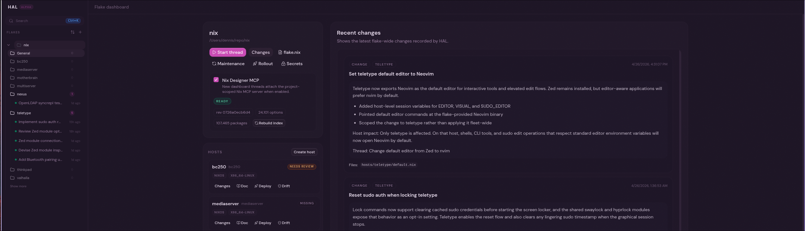
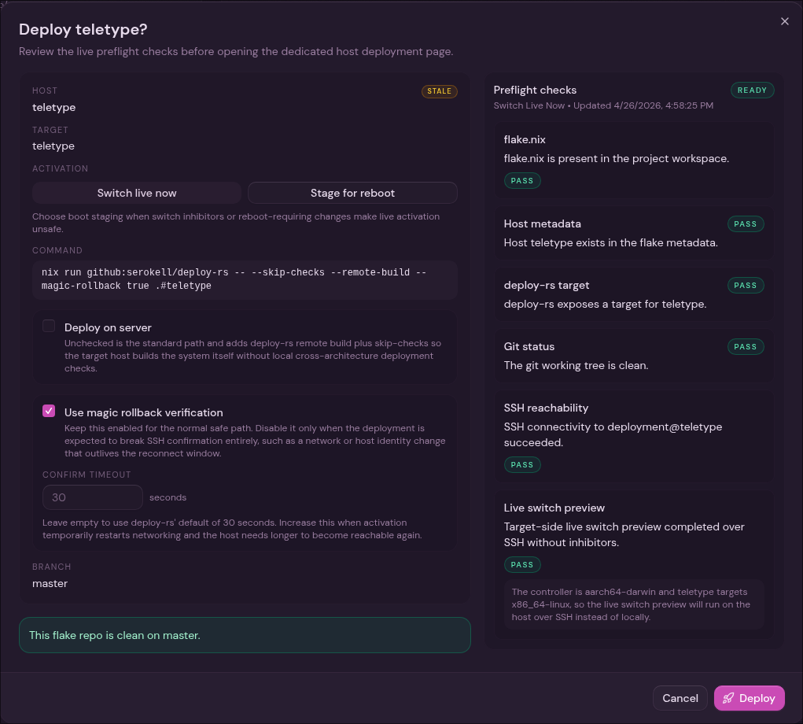
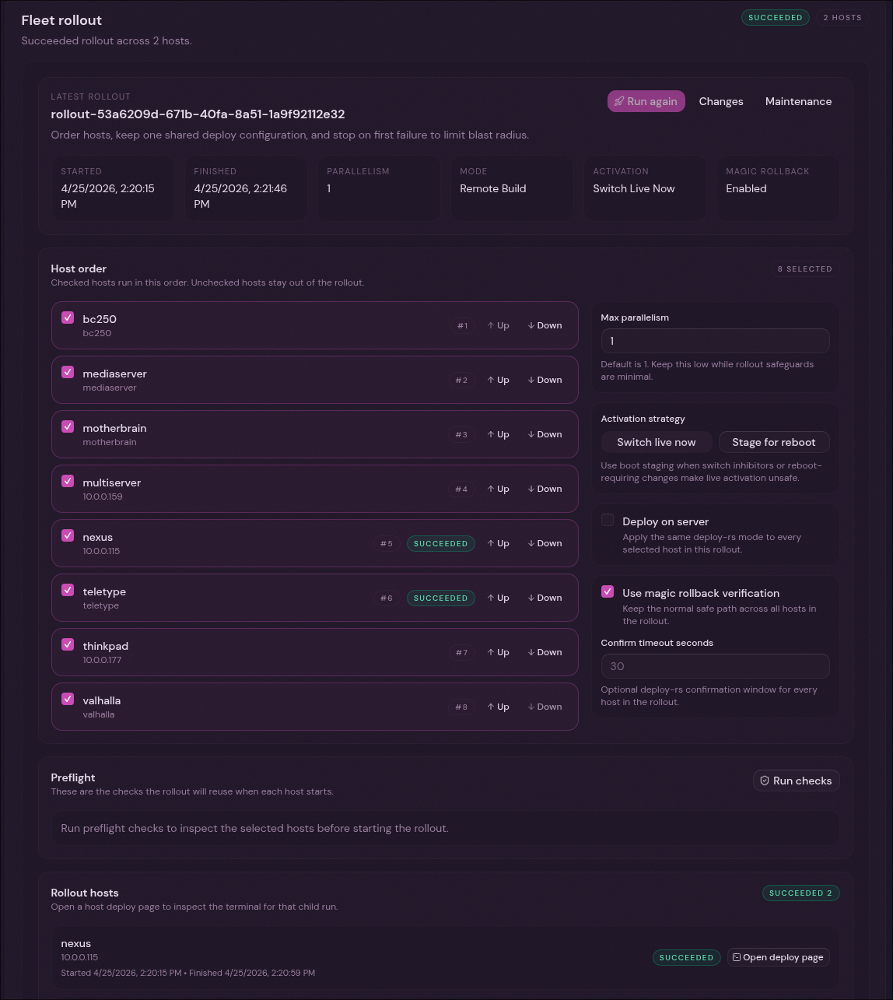
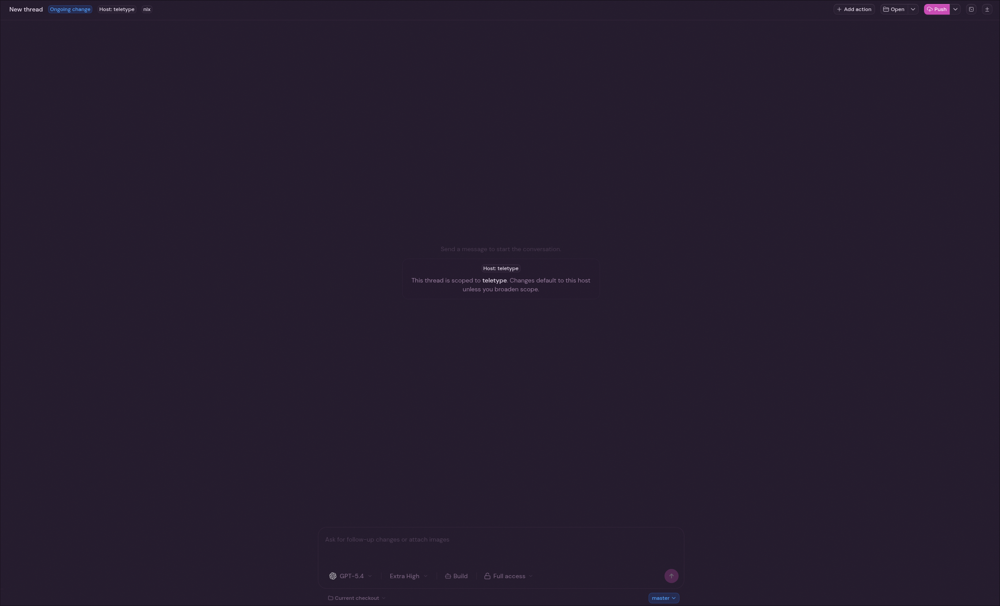

# HAL

HAL is a Nix AI Copilot and deployment server.
HAL supports you through the process of creating, managing and deploying Nix managed systems.

## Prelude

The docs are incomplete for now.
This is very much an experiment and the repo is moving fast.
I really like AI agents in combination with Nix. I do not think anyone has nailed the "Agentic OS Experience". I'm trying to showcase what can be possible.

If you find this and like any specific version, I suggest you save that for the time being, things will break.

## Why?

I was thinking about a tool like this for some time now. When T3 Code was released, it turned out to be the perfect basis for this.
I am building HAL to make my, and maybe your, life easier. 
HAL supports you in planning, changing, debugging and documenting Nix hosts.

## Main features

- Automatic change logs per change.
- Generate a host doc on request.
- Network deployment via deploy-rs integration.
- MCP and prompt supported hosts chats.
- Agent assisted host creation workflow with optional SSH scaffolding of live hosts.
- Agent assisted host deletion workflow.
- Nix MCP as source of truth for options. (Reduces hallucinations/version mismatches massively)

## Screenshots

### Flake dashboard

### Single host deployment overview

### Fleet deployment

### Host thread

## Contributing

I am not accepting contributions at this time.
